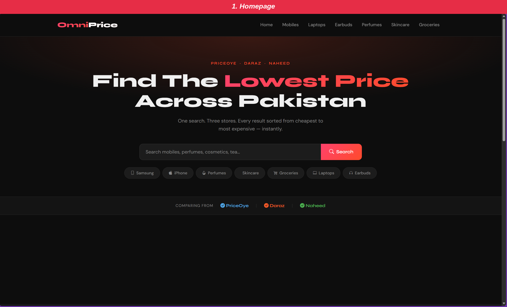
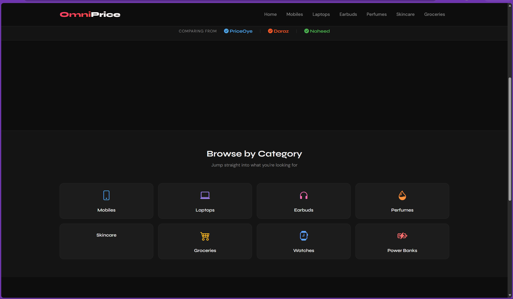
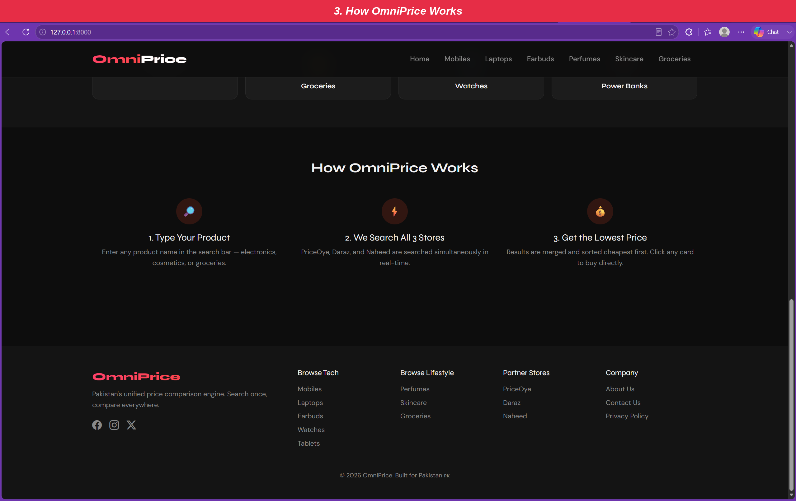
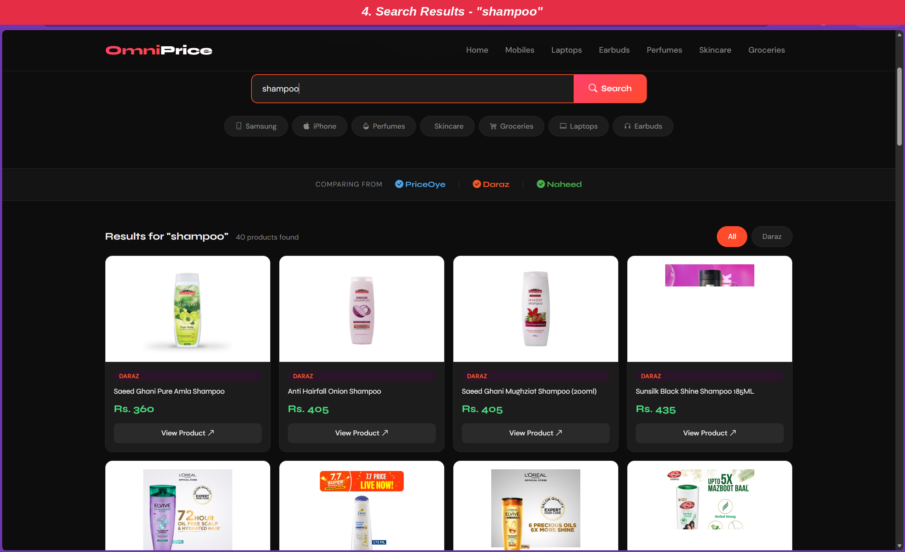
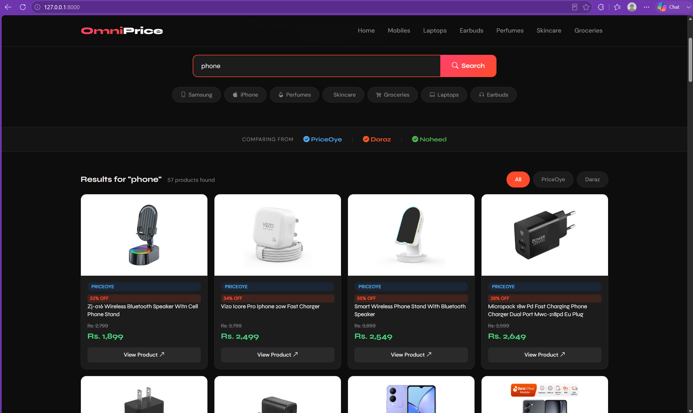

# OmniPrice - Pakistan's Unified Price Comparison Platform

**PriceOye · Daraz · Naheed**

A real-time price comparison web application that searches **PriceOye, Daraz, and Naheed** simultaneously and shows the best prices in one place.


## Project Overview

OmniPrice is a **Web Technologies Final Year Project** that solves the problem of manually checking prices across multiple Pakistani e-commerce websites. Users can search once and get unified results from **PriceOye, Daraz, and Naheed**, sorted from lowest to highest price.

## Screenshots

### Homepage
Search bar with quick category shortcuts, and a footer showing which stores are being compared (PriceOye, Daraz, Naheed).



### Browse by Category
Quick-access category tiles for Mobiles, Laptops, Earbuds, Perfumes, Skincare, Groceries, Watches, and Power Banks.



### How OmniPrice Works
A simple 3-step explainer: type your product, we search all 3 stores, and you get the lowest price — along with the full site footer and links.



### Search Results — "shampoo"
Unified, merged results pulled live from Daraz (and other connected stores), each card showing price and a direct "View Product" link.



### Search Results — "phone"
Results filterable by store (All / PriceOye / Daraz), with discount percentages and struck-through original prices clearly displayed.



## Key Features

- Real-time unified search across 3 major stores
- Results sorted by price (cheapest first)
- Store-wise filtering
- Discount percentage calculation
- Category browsing (Mobiles, Laptops, Earbuds, Perfumes, etc.)
- Persistent product storage in MySQL
- Responsive dark-themed UI with Bootstrap 5
- Static pages (About, Contact, Privacy)

## Technology Stack

| Layer              | Technology                          | Purpose |
|--------------------|--------------------------------------|--------|
| Backend            | Laravel 11 (PHP)                    | MVC Framework, Routing, Eloquent |
| PriceOye Scraper   | PHP + Guzzle                        | JSON API Integration |
| Daraz Scraper      | Node.js + Axios                     | AJAX Catalog API |
| Naheed Scraper     | PHP + Symfony DomCrawler            | HTML Parsing |
| Database           | MySQL + Eloquent ORM                | Persistent Storage |
| Frontend           | Blade + Bootstrap 5                 | Responsive UI |

## Folder Structure (Important)

- `app/Http/Controllers/` → `SearchController`, `DarazController`, `NaheedController`, etc.
- `scraper/daraz_scraper.mjs` → Daraz scraping script
- `resources/views/` → All Blade templates
- `routes/web.php` & `routes/api.php` → Application routes

## How to Run Locally

```bash
# 1. Go to project folder
cd omni-price-tracker

# 2. Install dependencies
composer install
npm install

# 3. Setup environment
cp .env.example .env
php artisan key:generate

# 4. Configure database in .env file

# 5. Run migrations
php artisan migrate

# 6. Start server
php artisan serve
```


